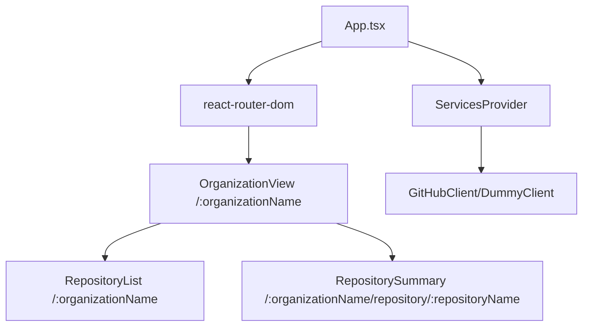

# React + GitHub by Crisman Carmona

A modern, responsive, and accessible GitHub organization explorer built with React, TypeScript, Vite, and TailwindCSS.

---

## Why these technologies?

- **TypeScript**: I chose TypeScript because it provides type safety, helps prevent bugs, and improves code quality and maintainability.
- **ESLint**: I use ESLint to ensure code quality, consistency, and to catch potential issues early in the development process.
- **Jest**: I chose Jest because it is a well-known library that I have extensive experience with. It allows me to create tests and validate every implementation in each iteration/commit. I also set up a GitHub Action to receive real-time notifications if a commit does not meet minimum requirements such as unit tests, coverage, or linting.
- **TailwindCSS**: I chose Tailwind because it is lightweight and provides an easy way to apply styles.
- **Vite**: I chose Vite because it enables building a React app from scratch using the latest industry standards.

---

## Features

- 🔍 Search and explore GitHub organizations and their repositories
- 📦 View repository details, languages, and metadata
- ⚡ Fast, modern UI with TailwindCSS and React 19
- 🧩 Modular architecture with service abstraction
- 🧪 Unit tests with Jest and Testing Library
- 🌀 Loading spinner for async operations
- 📱 Fully responsive and accessible design

---

## Requirements

- Node.js >= 18.0.0
- Yarn >= 4.0.0

## Quick Start

### If you have Yarn 1.x (Classic):

1. **Enable Corepack** (one-time setup):

   ```bash
   corepack enable
   ```

2. **Clone and install**:
   ```bash
   git clone https://github.com/ccarmona1/react-github
   cd react-github
   yarn install  # Will automatically use Yarn 4.9.2
   yarn dev
   ```

### If you already have Yarn 4.x:

```bash
git clone https://github.com/ccarmona1/react-github
cd react-github
yarn install
yarn dev
```

## Running the App

- `yarn preview` — Preview the production build - Open http://localhost:4173/ in your browser for preview
- `yarn dev` — Start the development server - Open http://localhost:5173/ in your browser for preview
- `yarn build` — Build for production
- `yarn test` — Run unit tests
- `yarn test:coverage` — Run unit test coverage
- `yarn lint` — Check code quality
- `yarn lint:strict` — Strict linting (no warnings)

---

## AI Assistance

This project was developed with the help of GitHub Copilot, an AI-powered coding assistant. Copilot provided code suggestions, best practices, and automated reviews throughout the development process to ensure code quality, consistency, and adherence to modern standards.

---

## Codebase Review by LLM

This project was reviewed by an LLM (GitHub Copilot) according to the internal guidelines defined in `.github/instructions/react.instructions.md`.  
The review covered all main files in the repository, checking for best practices in configuration, dependencies, code structure, styling, and testing.

### Review Summary

- **Configuration & Dependencies:**  
  The project uses Vite, Yarn, Jest, TypeScript, and TailwindCSS, as recommended. Config files are simple and do not include unnecessary options.

- **Styling:**  
  All styling is implemented exclusively with TailwindCSS, avoiding inline styles and traditional CSS files. The design is responsive, accessible, and consistent, following UI/UX best practices.

- **Source Code:**  
  The codebase is written in TypeScript, using functional React components and modern hooks. There are no comments, no duplicated logic, and no over-engineering. A reusable loading spinner component is present for async operations.

- **Testing:**  
  Unit tests use Jest and Testing Library, with no mocks or spies on `console.log`. `jest.mock` is used appropriately, and tests cover relevant cases.

- **Accessibility & UX:**  
  The project applies accessibility best practices and maintains a simple, attractive design without unnecessary complexity.

**Conclusion:**  
The codebase follows all standards and best practices defined in the internal instructions, maintaining clean, simple, accessible, and well-structured code.

---

> ⚠️ **Warning: GitHub API Rate Limit**
>
> This app uses the public GitHub API, which has strict rate limits for unauthenticated requests. If you encounter errors or missing data, you may have hit the rate limit. To avoid this, you can run the app in mock mode by setting `NODE_ENV=dev` to use a Dummy data provider instead of real GitHub requests.

---

## App Architecture



- `/:organizationName` shows organization info and repositories
- `/:organizationName/repository/:repositoryName` shows repository details
- `App.tsx` provides context and routes
- `ServicesProvider` injects services depending on the environment
- `react-router-dom` handles routing between views
- `GitHubClient/DummyClient` provides data (real or mock)

---

## Future Improvements

- Implement a robust error handling mechanism with user-friendly error messages and fallback UI components
- Add AbortController in data fetching hooks or the service layer to prevent duplicated GitHub requests
- Refactor TailwindCSS with more reusable components
- Add E2E tests (Cypress or Playwright)
- Add an input field to easily switch organizations from the UI (currently, organization changes are only possible via the URL path)

---

## Test Coverage Summary

```
Statements   : 94.63% ( 247/261 )
Branches     : 81.35% ( 96/118 )
Functions    : 90.47% ( 57/63 )
Lines        : 94.51% ( 224/237 )
```

---

## Git Tags

This repository includes the following Git tags to mark key milestones in the application's development:

- **1.0.0** — Version without styles
- **2.0.0** — Initial version with styles
- **3.0.0** — Final version of the app
