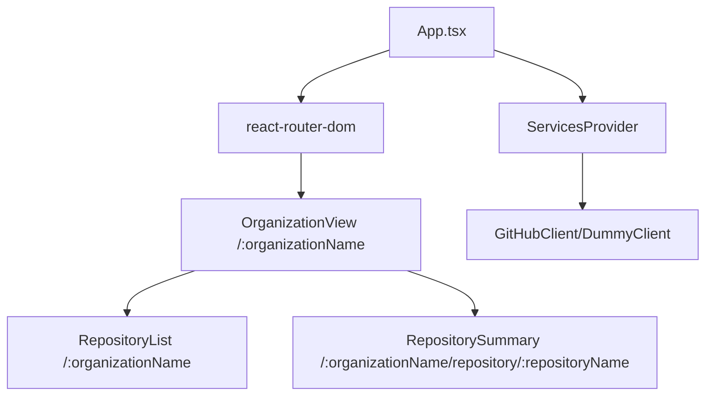

# React + GitHub by Crisman Carmona

A modern, responsive, and accessible GitHub organization explorer built with React, TypeScript, Vite, and TailwindCSS.

---

## Why these technologies?

- **TypeScript**: I chose TypeScript because it provides type safety, helps prevent bugs, and improves code quality and maintainability.
- **ESLint**: I use ESLint to ensure code quality, consistency, and to catch potential issues early in the development process.
- **Jest**: I chose Jest because it is a well-known library that I have extensive experience with. It allows me to create tests and validate every implementation in each iteration/commit. I also set up a GitHub Action to receive real-time notifications if a commit does not meet minimum requirements such as unit tests, coverage, or linting.
- **TailwindCSS**: I chose Tailwind because it is lightweight and provides an easy way to apply styles.
- **Vite**: I chose Vite because it enables building a React app from scratch using the latest industry standards.

---

## Features

- 🔍 Search and explore GitHub organizations and their repositories
- 📦 View repository details, languages, and metadata
- ⚡ Fast, modern UI with TailwindCSS and React 19
- 🧩 Modular architecture with service abstraction
- 🧪 Unit tests with Jest and Testing Library
- 🌀 Loading spinner for async operations
- 📱 Fully responsive and accessible design

---

## Requirements

- Node.js >= 18.0.0
- Yarn >= 4.0.0

## Quick Start

### If you have Yarn 1.x (Classic):

1. **Enable Corepack** (one-time setup):

   ```bash
   corepack enable
   ```

2. **Clone and install**:
   ```bash
   git clone https://github.com/ccarmona1/react-github
   cd react-github
   yarn install  # Will automatically use Yarn 4.9.2
   yarn dev
   ```

### If you already have Yarn 4.x:

```bash
git clone https://github.com/ccarmona1/react-github
cd react-github
yarn install
yarn dev
```

## Running the App

- `yarn dev` — Start the development server
- `yarn build` — Build for production
- `yarn preview` — Preview the production build
- `yarn test` — Run unit tests
- `yarn lint` — Check code quality
- `yarn lint:strict` — Strict linting (no warnings)
- Open http://localhost:4173/ in your browser for preview

---

> ⚠️ **Warning: GitHub API Rate Limit**
>
> This app uses the public GitHub API, which has strict rate limits for unauthenticated requests. If you encounter errors or missing data, you may have hit the rate limit. To avoid this, you can run the app in mock mode by setting `NODE_ENV=dev` to use a Dummy data provider instead of real GitHub requests.

---

## App Architecture



- `/:organizationName` shows organization info and repositories
- `/:organizationName/repository/:repositoryName` shows repository details
- `App.tsx` provides context and routes
- `ServicesProvider` injects services depending on the environment
- `react-router-dom` handles routing between views
- `GitHubClient/DummyClient` provides data (real or mock)

---

## Future Improvements

- Add AbortController to prevent duplicate GitHub requests
- Refactor TailwindCSS with more reusable components
- Add E2E tests (Cypress or Playwright)
- Enhance loading and error states
